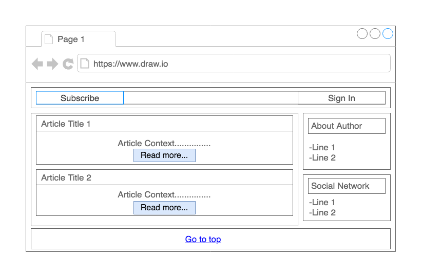
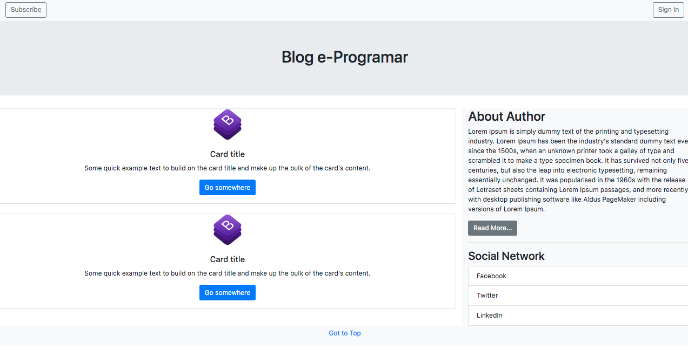
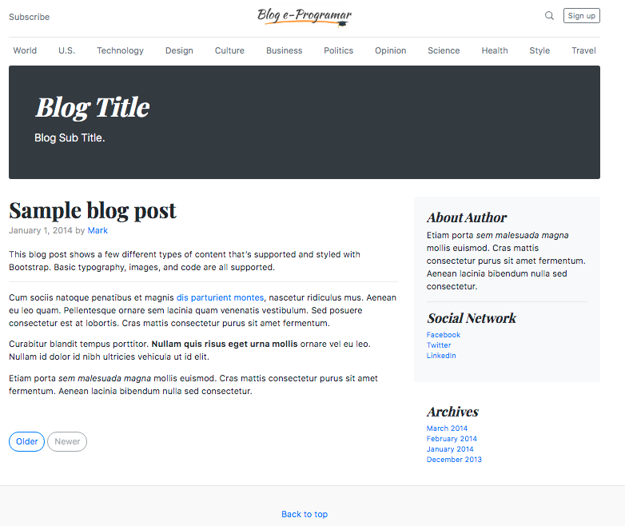

# Kotlin Web MVC with Spring Framework

Este projeto foi desenvolvido no curso e-Programar: **Kotlin Web com Spring Framework**,    
disponibilizado na Udemy.

**Stack**   

* Kotlin
* Gradle 
* Spring Web `WEB`
* Spring Data JPA `SQL`
* H2 Database `SQL`
* Thymeleaf `Template Engines`
* Bootstrap

### Prototype Mockup

### Prototype Bootstrap

### Template

